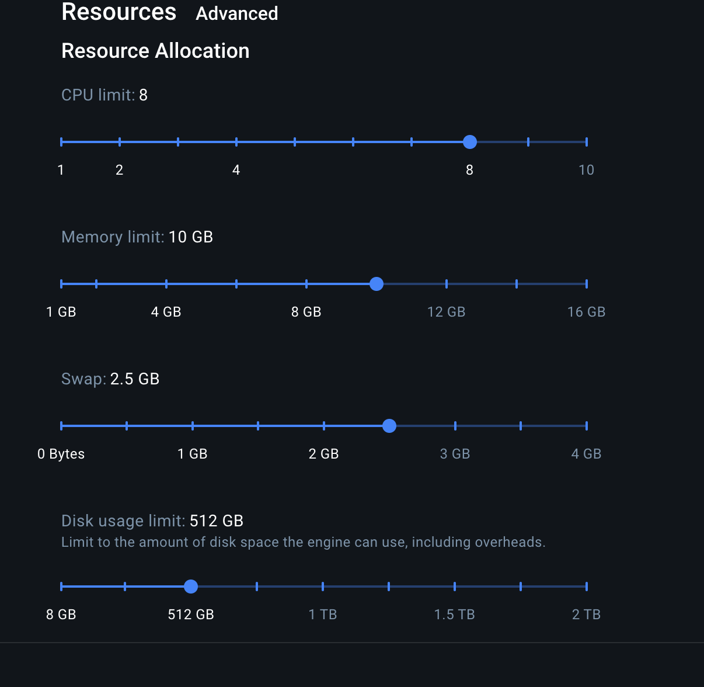

# Developing locally with Docker

To develop the Relayer and Cryptography Trust Suite locally, a docker setup was put in place to speed up onboarding, increase environment reproducibility and consistency, and increase productivity.

This setup targets developers working on the Relayer and Cryptography Trust Suite. While developing these services, the setup will automatically live-reload all changes for a better developer experience.

This solution will automatically initialize and update `.env` configurations, thus little action is required. In case something is not working as it should, you can safely delete `rayls-privacy-contracts/.env` as well as any `rayls-privacy-relayer-api/.<X>.env` or `rayls-privacy-pnh-governance-api/config-dev.json` files and start again.

## Requirements:
- Docker
- A directory structure like this:
  ```
  parfin/                              <- this can be named something else
    rayls-privacy-contracts/           <- required
    rayls-privacy-relayer-api/         <- this repo
    axyl/                              <- required for local mode (see Axyl section below)
    rayls-privacy-pnh-governance-api/  <- required for governance services. Use `--no-governance` to skip
    rayls-privacy-gnark-api/           <- required for the proofs API
    rayls-privacy-tests-automation/    <- optional; contracts are auto-synced here when present
  ```
- Branches for each repository:
  - rayls-privacy-contracts == version/3.0.0
  - rayls-privacy-relayer-api == version/3.0.0
  - axyl == main
  - rayls-privacy-pnh-governance-api == version/3.0.0 _(required for governance)_
  - rayls-privacy-gnark-api == version/3.0.0 _(required for local proofs API)_

## Running with Podman (rootless)

`start_dev.sh` also works with **rootless Podman** (via the `podman-docker` shim that provides a `docker` command). **Docker is the default** (it's what most of the team uses); Podman support is **opt-in** via `USE_PODMAN=true`, so a Docker user never gets Podman-specific tweaks by accident. When enabled, the tweaks are still **no-op-equivalent** on real Docker, so the same compose files serve both engines.

**One-time setup:**

```bash
sudo apt-get install -y podman-docker git-lfs   # docker shim + Git LFS (gnark verifiers use LFS)
systemctl --user enable --now podman.socket     # `docker compose` talks to this socket
loginctl enable-linger "$USER"                  # keep the socket alive across logout / long tmux sessions
export USE_PODMAN=true                           # opt in to Podman mode (add to your shell rc to persist)
```

**Enabling Podman mode:** it's off by default (Docker). Turn it on per-run or persist it:

```bash
USE_PODMAN=true ./start_dev.sh ...   # this run only
export USE_PODMAN=true               # all runs in this shell (or add to ~/.bashrc)
```

If you run on Podman without setting it, the script prints a hint and proceeds in Docker mode (which will fail with subuid/healthcheck errors).

**What the Podman path changes (and why):**

- **`contracts` deploy runs as root** (`CUSTOM_UID=0`/`CUSTOM_GID=0`). The deploy container must write image-baked root-owned dirs (e.g. `cache_forge`), and under rootless Podman the container's root maps to *your* host user — so the bindings/`.env` files it generates stay owned by you instead of a high subuid (e.g. `100999`). This is **dev-only** (the dev compose file) and safe: rootless Podman's user namespace means in-container root is **not** real host root, so there is no privilege escalation. On Docker the daemon is already root, so the real host uid/gid is used instead.
- **`private-hub` and `proofs-api` run with numeric users** (`1000:1000` and `999:999`). Podman's healthcheck cannot resolve those images' *named* users (`besu`, `appuser`) in `/etc/passwd`, which would mark the containers unhealthy even though the apps are fine. The numeric uid (matching the image's user) skips that lookup. If those upstream images change their UID, update the values in `start_dev.sh`.

**Troubleshooting:**

- *Files in sibling repos owned by a subuid (e.g. `100999`), `Permission denied` on `cp`:* reclaim them without sudo with `cd ~/projects && find . ! -uid "$(id -u)" ! -path '*/.git/*' -print0 | xargs -0 podman unshare chown 0:0`.
- *`down --volumes` fails with `rootless netns: kill network process: permission denied`:* with containers stopped, run `podman network prune -f && podman volume prune -f && podman system migrate`, then retry.

## Axyl

Axyl is the Rayls-based Privacy Node implementation written in Rust. It replaces the previous Geth-based Privacy Node. In local mode, the `start_dev.sh` script builds a Docker image (`local-axyl:latest`) directly from the `../axyl` repository.

### Cloning Axyl

Clone `axyl` as a sibling directory next to this repo (same parent folder):

```bash
git clone <axyl-repo-url> axyl
cd axyl
git checkout main
```

### Docker image build

The `local-axyl:latest` image is managed automatically:

- **Built on first run** if the image does not exist locally.
- **Auto-rebuilt** if `../axyl` has commits newer than the existing image.
- **Force rebuild** at any time with the `--rebuild-axyl` flag:

```bash
./start_dev.sh --rebuild-axyl
```

> **Note:** Axyl is a Rust project, so builds take several minutes. The script avoids unnecessary rebuilds — it only rebuilds when the source has actually changed.

## Before you start

`start_dev.sh` runs every service on your computer: a Postgres db, a Mongo db (used by the backend), Privacy Nodes (Axyl), a Private Hub (Besu), Proofs API, contract deployment automation, Governance services, Cryptography Trust Suites and Relayers. For reference, this docker environment takes ~3GB of memory for 2 participants. You can disable Governance services with the `--no-governance` flag.

## How to start

To begin with, ensure that:
1. Your terminal's current working directory is at `rayls-privacy-relayer-api`.
2. The script at `rayls-privacy-relayer-api/start_dev.sh` is executable on your machine. You can run `chmod +x start_dev.sh` on your terminal to make it executable.

In the `rayls-privacy-relayer-api` directory, type the following command on your terminal to run every service locally:
```
./start_dev.sh
```

It should display information about docker builds, the status of each service, and eventually logs from CTS instances and Relayers. Your terminal will be locked by the script, so if you need to do something else on the terminal you will need to open a new one.

## Stopping the docker development environment

To stop the environment, you can CTRL+C, and you also need to run

```
./compose.sh down
```
to stop all background services.

## Checking logs

To see all logs, you can type `./compose.sh logs -f` on a new terminal while the `./start_dev.sh` is running.

To see logs about specific services, you can do:

### Postgres

```
./compose.sh logs -f postgres
```

### MongoDB

```
./compose.sh logs -f mongodb
```

### Privacy Node

```
./compose.sh logs -f pn-a
```

For multiple ones:

```
./compose.sh logs -f pn-a pn-b
```

You can add more privacy nodes at the end of that command:

```
./compose.sh logs -f pn-a pn-b pn-c pn-d pn-e pn-f
```

### Private Hub

```
./compose.sh logs -f private-hub
```

### Contracts deployment

```
./compose.sh logs -f contracts
```

### Proofs API (ProofAPI)

```
./compose.sh logs -f proofs-api
```

### Governance API

```
./compose.sh logs -f governance-api
```

### Governance Flagger

```
./compose.sh logs -f governance-flagger
```

### Governance Listener

```
./compose.sh logs -f governance-listener
```

### Governance Postgres

```
./compose.sh logs -f governance-postgres
```

### Cryptography Trust Suite

```
./compose.sh logs -f cts-a
```

For multiple ones:

```
./compose.sh logs -f cts-a cts-b
```

You can add more CTS instances at the end of that command:

```
./compose.sh logs -f cts-a cts-b cts-c cts-d cts-e cts-f
```

### Relayer Service

```
./compose.sh logs -f relayer-a
```

For multiple ones:

```
./compose.sh logs -f relayer-a relayer-b
```

You can add more relayers at the end of that command:

```
./compose.sh logs -f relayer-a relayer-b relayer-c relayer-d relayer-e relayer-f
```

### Public Relayer Service

```
./compose.sh logs -f pubrelayer-a
```

For multiple ones:

```
./compose.sh logs -f pubrelayer-a pubrelayer-b
```

You can add more public relayers at the end of that command:

```
./compose.sh logs -f pubrelayer-a pubrelayer-b pubrelayer-c pubrelayer-d pubrelayer-e pubrelayer-f
```

## Running tests from rayls-privacy-contracts

To run tests you will need to execute them from inside the `contracts` container:

### Performance tests

For performance tests, you need to run:

```
./test_docker.sh p
```
or
```
./compose.sh exec contracts bash -c "npm run test:p"
```

### E2E tests

For End-To-End tests, you need to run:

```
./test_docker.sh e2e
```
or
```
./compose.sh exec contracts bash -c "npm run test:e2e"
```

### Other tests

For other tests, you need to run:

```
./test_docker.sh <other test here>
```
or
```
./compose.sh exec contracts bash -c "npm run test:<other test here>"
```

## How to debug Cryptography Trust Suite or Relayers

There are pre-configured debug profiles for the IDEs VSCode and GoLand, so all you need to do is start the development environment, and then start a debugging session on a running service. Stopping the debugging session will not stop the service from running. Also, if you change code while debugging, the debugging session will stop due to the live-reload functionality.

## How to disable Governance services?

You can disable all the Governance services with flag `--no-governance`, like so: `./start_dev.sh --no-governance`

If you only want Flagger, Listener and Postgres running, you can use `--no-governance-api` like so: `./start_dev.sh --no-governance-api`

## Configuring OAuth (Google / Microsoft) for ops-api

The dev stack runs two ops-api containers (`ops-api-a` on `:9780`, `ops-api-b` on `:9880`) that handle Google and Microsoft OAuth flows on behalf of the playground. By default they boot with empty credentials and the OAuth endpoints respond with HTTP 404 — wallet/SIWE login still works, but the "Sign in with Google/Microsoft" buttons in the playground do not.

Port layout: each ops-api instance listens on `9780 + N*100` where `A=0, B=1, … F=5`. Today only A (`:9780`) and B (`:9880`) run; slots C–F are reserved so the OAuth client only needs to be set up once.

To enable OAuth login locally:

1. **Google**: create a single OAuth 2.0 Client ID in [Google Cloud Console → APIs & Services → Credentials](https://console.cloud.google.com/apis/credentials) (Application type: Web). On that same client, add **all six** redirect URIs (`A` and `B` are needed today; `C`–`F` are forward-compatible):

   ```
   http://localhost:9780/auth/google/callback   # ops-api-a (active)
   http://localhost:9880/auth/google/callback   # ops-api-b (active)
   http://localhost:9980/auth/google/callback   # ops-api-c (reserved)
   http://localhost:10080/auth/google/callback  # ops-api-d (reserved)
   http://localhost:10180/auth/google/callback  # ops-api-e (reserved)
   http://localhost:10280/auth/google/callback  # ops-api-f (reserved)
   ```

   Mirror the same six in "Authorized JavaScript origins" (`http://localhost:9780`, `:9880`, `:9980`, `:10080`, `:10180`, `:10280`).

2. (Optional) **Microsoft**: create an App Registration in Azure AD with the matching redirect URIs at `/auth/microsoft/callback` on each of the six ports.

3. Copy the credentials into a gitignored `.env.oauth` at the repo root:

   ```bash
   cp .env.oauth.example .env.oauth
   # edit and fill in GOOGLE_CLIENT_ID / GOOGLE_CLIENT_SECRET (and optionally MICROSOFT_*)
   ```

4. Restart the stack. `start_dev.sh` sources `.env.oauth` and the values are propagated into both ops-api containers via Compose; the playground instances at `http://localhost:3700-3702` then redirect through `ops-api-a` or `ops-api-b` for the login flow.

## Playground (one instance per chain)

The dApp at `rayls-privacy-playground` is single-chain: each container binds to exactly one chain via the `NEXT_PUBLIC_CHAIN_*` env vars. The stack runs one playground per chain (Hub + one per Privacy Node):

| Chain | URL | Chain ID | Bound ops-api |
|---|---|---|---|
| Private Hub | `http://localhost:3700` | 1337 | ops-api-a (placeholder; Hub-side ops-api not yet implemented) |
| Privacy Node A | `http://localhost:3701` | 12345 | ops-api-a (`:8780`) |
| Privacy Node B | `http://localhost:3702` | 12346 | ops-api-b (`:8880`) |

All three share the same source via bind-mount (`../rayls-privacy-playground:/app`) and each has its own named volumes for `node_modules` and `.next` to keep parallel `npm run dev` processes from colliding on the build cache. Hot-reload reaches all three on every source edit.

Per-chain settings the compose injects:
- `NEXT_PUBLIC_CHAIN_ID` / `NAME` / `RPC_URL` — hardcoded per service block.
- `NEXT_PUBLIC_CHAIN_REGISTRY_ADDRESS` — extracted at start-up from `../rayls-privacy-contracts/.env` (`PNH_DEPLOYMENT_PROXY_REGISTRY` for the Hub, `PRIVACY_NODE_{A,B}_DEPLOYMENT_PROXY_REGISTRY` for the PNs).
- `NEXT_PUBLIC_CHAIN_IS_HUB` — `true` only on the Hub instance.
- `NEXT_PUBLIC_CHAIN_AUDITOR_ADDRESS` (PN) / `NEXT_PUBLIC_PH_AUDITOR_ADDRESS` (Hub) — optional, sourced from `.env.oauth` if set.
- `BLOCKSCOUT_<chainId>` — server-side proxy to the corresponding Blockscout instance (omitted on the Hub since no Blockscout exists for chain 1337).

**Hub caveat:** logging in via Google on `:3700` still hits `ops-api-a` (placeholder), so identity works but Hub-specific views may gate via `use-auditor.ts` until a Hub-side ops-api ships.

**Adding more participants (C–F):** the compose ships with `playground-{hub,a,b}` only. To extend, copy a PN block, bump the port (`3703…3706`), set `NEXT_PUBLIC_CHAIN_ID` to `12347…12350`, point `NEXT_PUBLIC_CHAIN_REGISTRY_ADDRESS` at `${OPS_API_<X>_DEPLOYMENT_PROXY_REGISTRY:-…}`, `NEXT_PUBLIC_OPS_SERVICE_URL` at the matching ops-api port (`8980…9280`), and add the volumes. `start_dev.sh` already picks up the corresponding `playground-<lc>` service name when `PARTICIPANT_LIST` grows.

### Automatic admin bootstrap

When `OPS_ADMIN_EMAIL` is also set in `.env.oauth`, `start_dev.sh` runs the following for every participant after the stack comes up:

1. `POST /admin/bootstrap` on each ops-api to create the initial admin user with a custody-provisioned wallet.
2. `npx hardhat grant-business-role` on the contracts repo to give that wallet the `PRIVACY_NODE_OPERATOR` role on the matching Privacy Node.

Use the same email you log in with through Google OAuth — without the role, `/api/me` would return 403 after a successful Google sign-in. The bootstrap runs in the background while `docker compose up --watch` is in the foreground; its progress is prefixed with `[bootstrap]`. When the endpoint returns 409 (already bootstrapped), the script logs and skips. To rebootstrap from scratch, run `./start_dev.sh -c`, which wipes the `ops_api_*` databases along with chain state.

Hub bootstrap (role `PRIVATE_NETWORK_OPERATOR`) is not yet automated; do it manually after the stack is up.

The host needs `jq` installed for the bootstrap step (`apt install jq` / `brew install jq`). If it's missing, the step is skipped with a warning.

## Open Telemetry (OTeL)

There is integration with Open Telemetry protocol for logs, traces and metrics. By default the OTeL services are started and can be disabled with `--no-otel` flag when running the `start_dev.sh` script. To access OTeL services use the following URLs:
- Grafana UI: http://otel:3300
- Prometheus UI (metrics): http://otel:3090
- Pyroscope UI (profiling): http://otel:3040

# FAQ

## How many Privacy Nodes, Cryptography Trust Suites and Relayers does this start by default?

2 of each to speed up development, although 6 is the minimum required for Enygma tests.

## How do I run this setup with 4 or 6 participants?

You can run this setup with 4 Privacy Nodes, Cryptography Trust Suites and Relayers like so:
```
./start_dev.sh 4
```

Or like this if you want 6:
```
./start_dev.sh 6
```

You cannot start this environment with less than 2 participants, neither more than 6 for now.

## How can I use the `./start_dev.sh` script?

To learn more about how to use the script, you can execute:

`./start_dev.sh -h`

Which will print:

```
Usage: ./start_dev.sh [options] [num_participants]

Options:
  -sc, --soft-clean      Wipe relayer + pubrelayer databases. Keeps CTS, governance, contracts, and chain nodes (PNs/PNH/Public Chain)
  -c, --clean            Tears down everything (volumes, contracts, nodes) and redeploys from scratch
  --rebuild-axyl         Force rebuild of the local-axyl Docker image from ../axyl
  --epoch-duration N     Override the chain's epoch_duration (in seconds). Default 86400 (24h).
                         Lower this (e.g. 60) to trigger frequent epoch transitions.
                         Value is baked into chain genesis; requires --clean to change.
  --no-governance        Don't start Governance. No API, no Flagger, no Listener and no Postgres
  --no-governance-api    Don't start Governance API or Auditor Explorer, but start Flagger, Listener and Postgres
  --no-explorers         Don't start explorer services (e.g. Auditor Explorer). Useful for e2e tests
  --no-otel              Don't start OTEL (OpenTelemetry)
  --no-public-chain      Don't start public chain and public relayers
  --no-blockscout        Don't start Blockscout explorers per participant
  --no-ops-api           Don't start Ops API (per-participant API + worker) and Custody (HSM)
  --no-playground        Don't start the Playground dApp (Next.js, port 3700)
  -h, --help             Display this help message

Arguments:
  num_participants       Number of participants (2-6), default: 2

Examples:
  ./start_dev.sh              # Resume: restart services with existing state
  ./start_dev.sh 4
  ./start_dev.sh -sc 4        # Soft clean: wipe relayer + pubrelayer DBs, keep CTS/governance/contracts
  ./start_dev.sh -c 4         # Clean: nuke everything, redeploy contracts
  ./start_dev.sh -c --no-governance-api --no-otel 6
  ./start_dev.sh -c --rebuild-axyl 6
```

## What happens when I run `./start_dev.sh` script with a different number of participants?

It will detect it, automatically configure .env files and launch a clean environment.

## How are smart contract bindings handled?

The `contracts` container generates Go bindings and copies them to your `rayls-privacy-relayer-api` directory automatically, when you start the environment. You might need to start a clean environment so that it redeploys new contracts like so: `./start_dev.sh -c` or `./start_dev.sh --clean`

## What do I do after editing `postgres-init.sh`?

The Postgres service runs a custom image built from
`docker/development/postgres.Dockerfile`, which **bakes `postgres-init.sh` into the
image** (it is no longer a live bind mount). `./start_dev.sh` rebuilds it
automatically on every run (postgres is part of `BASE_SERVICES`), so normally you
don't need to do anything.

If you run `docker compose` directly instead of `start_dev.sh`, rebuild the image
after editing the script, otherwise the container keeps the old one:

```
docker compose -f docker-compose.dev-local.yml up -d --build postgres
```

or

```
docker compose -f docker-compose.dev-local.yml build postgres
```

## What do I do after pulling new commits from the axyl repo?

In most cases: nothing. The script auto-detects when `../axyl` has commits newer than the cached `local-axyl:latest` image and rebuilds automatically on the next run.

If you want to force a rebuild regardless of the auto-detect, pass `--rebuild-axyl`:

```
./start_dev.sh --rebuild-axyl
```

Or combined with a clean state:

```
./start_dev.sh -c --rebuild-axyl
```

## How can I run hardhat scripts or tasks in this setup?

To run hardhat scripts or tasks, you need to execute them inside the `contracts` container. This is the command you can use:

```
./compose.sh exec contracts bash -c "npx hardhat <task/script here>"
```

Or if you want more flexibility, open a terminal inside the container, where you'll get access to all the tools from the rayls-privacy-contracts repository:

```
./compose.sh exec contracts bash
```

## How can I run hardhat tasks/scripts directly from my computer instead of inside docker?

You need to update your `/etc/hosts` file by adding the following entries:
```
127.0.0.1 mongodb
127.0.0.1 mongo-express
127.0.0.1 pn-a
127.0.0.1 pn-b
127.0.0.1 pn-c
127.0.0.1 pn-d
127.0.0.1 pn-e
127.0.0.1 pn-f
127.0.0.1 private-hub
127.0.0.1 public-chain
127.0.0.1 contracts
127.0.0.1 proofs-api
127.0.0.1 gnark-api
127.0.0.1 ops-api-a
127.0.0.1 ops-api-b
127.0.0.1 ops-api-c
127.0.0.1 ops-api-d
127.0.0.1 ops-api-e
127.0.0.1 ops-api-f
127.0.0.1 custody-a
127.0.0.1 custody-b
127.0.0.1 custody-c
127.0.0.1 custody-d
127.0.0.1 custody-e
127.0.0.1 custody-f
127.0.0.1 cts-a
127.0.0.1 cts-b
127.0.0.1 cts-c
127.0.0.1 cts-d
127.0.0.1 cts-e
127.0.0.1 cts-f
127.0.0.1 relayer-a
127.0.0.1 relayer-b
127.0.0.1 relayer-c
127.0.0.1 relayer-d
127.0.0.1 relayer-e
127.0.0.1 relayer-f
127.0.0.1 pubrelayer-a
127.0.0.1 pubrelayer-b
127.0.0.1 pubrelayer-c
127.0.0.1 pubrelayer-d
127.0.0.1 pubrelayer-e
127.0.0.1 pubrelayer-f
127.0.0.1 governance-api
127.0.0.1 governance-flagger
127.0.0.1 governance-listener
127.0.0.1 governance-postgres
127.0.0.1 otel
127.0.0.1 nats-a
127.0.0.1 nats-b
127.0.0.1 nats-c
127.0.0.1 nats-d
127.0.0.1 nats-e
127.0.0.1 nats-f
```

On Windows 11, even with WSL2, you need to update the file `C:\Windows\System32\drivers\etc\hosts` with the same configuration above.

After that you should be able to run hardhat commands directly from your computer. Or check if the contracts deployment is finished at [http://contracts:7000](http://contracts:7000).

## How can I run or debug CTS or Relayer locally, instead of using docker?

First, you need to update your `/etc/hosts` like mentioned above ⬆️, and then you can start debugging using a profile configured for your IDE. There are pre-configured profiles for VSCode and GoLand.

## How can I open a terminal inside a container?

To open a terminal inside a container, you can use the `exec` command from docker to open a bash terminal. For example, to do so on the contracts container, you can type:

```
./compose.sh exec contracts bash
```

For Postgres:
```
./compose.sh exec postgres bash
```

For MongoDB:
```
./compose.sh exec mongodb bash
```

## How long does it take to spin off the whole environment?

On a x86_64 host, you can expect ~5min until all the environment is setup with 6 Privacy Nodes, 6 Cryptography Trust Suites, 6 Relayers, Governance and Proofs API. The timings measured at the time of this writing, without taking into account building docker images, are:

1. ~30s to start Postgres, Mongo, 6 Privacy Nodes and Proofs API
2. ~2min 30s to deploy all smart contracts
3. ~30s to start Governance Services
4. ~1min to compile and start 6 Cryptography Trust Suites
5. ~1min 12s to compile and start 6 Relayers

Total: ~5min 42s.

On a 4 participant setup (4 Privacy Nodes, 4 Cryptography Trust Suites, 4 Relayers, Governance and Proofs API), these are the timings:

1. ~20s to start Postgres, Mongo, 4 Privacy Nodes and Proofs API
2. ~2min to deploy all smart contracts
3. ~30s to start Governance Services
4. ~46s to compile and start 4 Cryptography Trust Suites
5. ~47s to compile and start 4 Relayers

Total: ~4min 23s.

On a 2 participant setup (2 Privacy Nodes, 2 Cryptography Trust Suites, 2 Relayers, Governance and Proofs API), these are the timings:

1. ~30s to start Postgres, Mongo, 2 Privacy Nodes and Proofs API
2. ~1min 56s to deploy all smart contracts
3. ~30s to start Governance Services
4. ~26s to compile and start 2 Cryptography Trust Suites
5. ~33s to compile and start 2 Relayers

Total: ~3min 55s.

> **Note on Axyl image build time:** Building the `local-axyl:latest` image from source (Rust) takes an additional ~5-10 minutes on the first run or after `--rebuild-axyl`. This happens once and is then cached.

## How long do tests take to run?

On a 6 participant setup, these are the measured times:
- Performance tests: 1min
- End-to-End tests: <TODO: measuring>

On a 4 participant setup, these are the measured times:
- Performance tests: 49s
- End-to-End tests: N/A because it needs 6 participants

On a 2 participant setup, these are the measured times:
- Performance tests: 42s
- End-to-End tests: N/A because it needs 6 participants

## Is it safe to delete .env files? And which ones can I delete?

It is safe to delete `../rayls-privacy-contracts/.env`, any `rayls-privacy-relayer-api/.<X>.env` files and also `../rayls-privacy-pnh-governance-api/config-dev.json` because they will be recreated and updated when you start the environment again with `./start_dev.sh --clean`.

## What should I do if I update any contracts or Privacy Node code?

After you update any contracts, hardhat tasks or scripts, tests, or even Privacy Node code, you will need to start a clean environment. That is because the rayls-privacy-contracts repository is copied when you first started the environment, and it does not support live-reload. You can start a clean environment with `-c`/`--clean` flag like so:

```
./start_dev.sh -c
```
or
```
./start_dev.sh --clean
```

If you updated Axyl code, also add `--rebuild-axyl`:

```
./start_dev.sh -c --rebuild-axyl
```

## What consensus mechanism do local Privacy Nodes use?

Local privacy nodes run Axyl (Rayls consensus). Each participant chain runs a single validator node in `--dev` mode — a one-of-one committee running the real Bullshark consensus (no Byzantine fault tolerance; local development only). Block time is 1s.

## What is the block time for the local Private Hub (Besu)?

The local Private Hub, powered by Besu, uses the Clique consensus with a block time of 1s.

## Does this work on MacOS with an arm64 processor like M1/2/3/4?

This was tested on MacOS with arm64 processor and it worked. It is worth noting that if your mac only has 16GB of memory, you may consider changing the Memory and Swap limits in your Docker Desktop settings, under Resources. Do not set memory limit to maximum as it is known to cause stability issues. Here's a configuration that is known to work:



It is worth noting that [OrbStack](https://orbstack.dev/) helps with performance, and Mac users are advised to use it.

## Does this work on other arm64 processors like a Raspberry Pi?

This was not tested, although the macOS arm64 seems to have paved the way for that.

## Does this work on Windows?

In order for this to work on Windows, you will need to use WSL2 with Ubuntu 24.04.

## On which systems has this setup been tested on?

- Ubuntu 24.04 under WSL2 on Windows 11 PRO (x86_64)
- Ubuntu 22.04 (x86_64)
- macOS M2 (arm64/v8)
- macOS M2 PRO (arm64/v8)

## I got error `no space left on device`. What does it mean and what should I do?

Usually this error is caused by docker running out of disk space for its images. During development it is common for images to be rebuilt and they will eventually fill up the disk. Unless you want to manually delete some of them, you can use this command to prune the docker system and free up disk space:
```
docker system prune -a -f
```
Keep in mind this will not delete docker volumes. If you do want this, you can add `--volumes`, but remember that any other containers you might be running on your computer may lose their data, so use with caution if you have other containers that you can't afford to lose data.

## I got an error related to internet connectivity. What happened and how do I solve this?

Sometimes docker can get into trouble while building images and display errors related to connectivity. Often times, it is enough to restart it.

On Linux you can run on your terminal `sudo systemctl restart docker`.

On macOS you can use your Docker Desktop GUI to restart it.

## What are the network names and ports for all the services?

Every axyl network runs a single validator in `--dev` mode (a one-of-one
committee). The Privacy Nodes follow the convention `pn-a` … `pn-f`; the public
chain uses `public-chain`. Each validator exposes its host ports as listed below.

**URL conventions in this table:**

- **Host-browser URL** uses `http://localhost:<host-port>` — every service binds
  to `127.0.0.1`, so these links work from your dev machine (or anything running
  on the same loopback, e.g. CI runners).
- **In-docker URL** uses `http://<service-name>:<container-port>` — the Docker
  network DNS hostname plus the *container* port, which may differ from the
  host port (e.g. `auditor-explorer` is published at host `4080` but listens on
  container `80`).
- Where host port = container port, both URLs reference the same port number.

| Service             | PORTS (TCP)                                                                                                                                                                                                                                                                                                                                                                                                                                                                                                                                                                                       |
| ------------------- | --------------------------------------------------------------------------------------------------------------------------------------------------------------------------------------------------------------------------------------------------------------------------------------------------------------------------------------------------------------------------------------------------------------------------------------------------------------------------------------------------------------------------------------------------------------------------------------------------- |
| contracts           | [Healthcheck: 7000](http://localhost:7000) · [(docker) contracts:7000](http://contracts:7000)                                                                                                                                                                                                                                                                                                                                                                                                                                                                                                      |
| postgres            | 5432 (host) · postgres:5432 (in-docker)                                                                                                                                                                                                                                                                                                                                                                                                                                                                                                                                                            |
| private-hub         | [RPC: 3445](http://localhost:3445) · [(docker) private-hub:3445](http://private-hub:3445) <br> Chain ID: 1337                                                                                                                                                                                                                                                                                                                                                                                                                                                                                      |
| public-chain        | [RPC: 8845](http://localhost:8845) · [(docker) public-chain:8845](http://public-chain:8845) <br> Chain ID: 7331                                                                                                                                                                                                                                                                                                                                                                                                                                                                                    |
| mongodb             | 27017 (host) · mongodb:27017 (in-docker)                                                                                                                                                                                                                                                                                                                                                                                                                                                                                                                                                           |
| mongo-express       | [UI: 9988](http://localhost:9988) · [(docker) mongo-express:8081](http://mongo-express:8081)                                                                                                                                                                                                                                                                                                                                                                                                                                                                                                       |
| proofs-api          | [API: 3003](http://localhost:3003/) · [(docker) proofs-api:3003](http://proofs-api:3003/) <br> [Healthcheck](http://localhost:3003/healthcheck) · [(docker)](http://proofs-api:3003/healthcheck)                                                                                                                                                                                                                                                                                                                                                                                                    |
| pn-a                | [RPC: 8545](http://localhost:8545) · [(docker) pn-a:8545](http://pn-a:8545) <br> [Consensus metrics: 9545](http://localhost:9545) · [(docker) pn-a:9101](http://pn-a:9101) <br> [Execution metrics: 9645](http://localhost:9645) · [(docker) pn-a:9200](http://pn-a:9200)                                                                                                                                                                                                                                                                                                                           |
| pn-b                | [RPC: 8546](http://localhost:8546) · [(docker) pn-b:8546](http://pn-b:8546) <br> [Consensus metrics: 9546](http://localhost:9546) · [(docker) pn-b:9101](http://pn-b:9101) <br> [Execution metrics: 9646](http://localhost:9646) · [(docker) pn-b:9200](http://pn-b:9200)                                                                                                                                                                                                                                                                                                                           |
| pn-c                | [RPC: 8547](http://localhost:8547) · [(docker) pn-c:8547](http://pn-c:8547)                                                                                                                                                                                                                                                                                                                                                                                                                                                                                                                        |
| pn-d                | [RPC: 8548](http://localhost:8548) · [(docker) pn-d:8548](http://pn-d:8548)                                                                                                                                                                                                                                                                                                                                                                                                                                                                                                                        |
| pn-e                | [RPC: 8549](http://localhost:8549) · [(docker) pn-e:8549](http://pn-e:8549)                                                                                                                                                                                                                                                                                                                                                                                                                                                                                                                        |
| pn-f                | [RPC: 8550](http://localhost:8550) · [(docker) pn-f:8550](http://pn-f:8550)                                                                                                                                                                                                                                                                                                                                                                                                                                                                                                                        |
| auditor-explorer    | [UI: 4080](http://localhost:4080) · [(docker) auditor-explorer:80](http://auditor-explorer:80)                                                                                                                                                                                                                                                                                                                                                                                                                                                                                                     |
| cts-a               | [gRPC: 8080](http://localhost:8080) · [(docker) cts-a:8080](http://cts-a:8080) <br> [HTTP: 8090](http://localhost:8090/ready) · [(docker) cts-a:8090](http://cts-a:8090/ready) <br> [Debug: 4000](http://localhost:4000) · [(docker) cts-a:4000](http://cts-a:4000) <br> FI: 6800 \*                                                                                                                                                                                                                                                                                                                |
| cts-b               | [gRPC: 8081](http://localhost:8081) · [(docker) cts-b:8081](http://cts-b:8081) <br> [HTTP: 8091](http://localhost:8091/ready) · [(docker) cts-b:8091](http://cts-b:8091/ready) <br> [Debug: 4001](http://localhost:4001) · [(docker) cts-b:4001](http://cts-b:4001) <br> FI: 6801 \*                                                                                                                                                                                                                                                                                                                |
| cts-c               | [gRPC: 8082](http://localhost:8082) · [(docker) cts-c:8082](http://cts-c:8082) <br> [HTTP: 8092](http://localhost:8092/ready) · [(docker) cts-c:8092](http://cts-c:8092/ready) <br> [Debug: 4002](http://localhost:4002) · [(docker) cts-c:4002](http://cts-c:4002) <br> FI: 6802 \*                                                                                                                                                                                                                                                                                                                |
| cts-d               | [gRPC: 8083](http://localhost:8083) · [(docker) cts-d:8083](http://cts-d:8083) <br> [HTTP: 8093](http://localhost:8093/ready) · [(docker) cts-d:8093](http://cts-d:8093/ready) <br> [Debug: 4003](http://localhost:4003) · [(docker) cts-d:4003](http://cts-d:4003) <br> FI: 6803 \*                                                                                                                                                                                                                                                                                                                |
| cts-e               | [gRPC: 8084](http://localhost:8084) · [(docker) cts-e:8084](http://cts-e:8084) <br> [HTTP: 8094](http://localhost:8094/ready) · [(docker) cts-e:8094](http://cts-e:8094/ready) <br> [Debug: 4004](http://localhost:4004) · [(docker) cts-e:4004](http://cts-e:4004) <br> FI: 6804 \*                                                                                                                                                                                                                                                                                                                |
| cts-f               | [gRPC: 8085](http://localhost:8085) · [(docker) cts-f:8085](http://cts-f:8085) <br> [HTTP: 8095](http://localhost:8095/ready) · [(docker) cts-f:8095](http://cts-f:8095/ready) <br> [Debug: 4005](http://localhost:4005) · [(docker) cts-f:4005](http://cts-f:4005) <br> FI: 6805 \*                                                                                                                                                                                                                                                                                                                |
| relayer-a           | [Healthcheck: 9000](http://localhost:9000/healthcheck) · [(docker) relayer-a:9000](http://relayer-a:9000/healthcheck) <br> [Debug: 4010](http://localhost:4010) · [(docker) relayer-a:4010](http://relayer-a:4010) <br> FI: 6660 \*                                                                                                                                                                                                                                                                                                                                                                |
| relayer-b           | [Healthcheck: 9001](http://localhost:9001/healthcheck) · [(docker) relayer-b:9001](http://relayer-b:9001/healthcheck) <br> [Debug: 4011](http://localhost:4011) · [(docker) relayer-b:4011](http://relayer-b:4011) <br> FI: 6661 \*                                                                                                                                                                                                                                                                                                                                                                |
| relayer-c           | [Healthcheck: 9002](http://localhost:9002/healthcheck) · [(docker) relayer-c:9002](http://relayer-c:9002/healthcheck) <br> [Debug: 4012](http://localhost:4012) · [(docker) relayer-c:4012](http://relayer-c:4012) <br> FI: 6662 \*                                                                                                                                                                                                                                                                                                                                                                |
| relayer-d           | [Healthcheck: 9003](http://localhost:9003/healthcheck) · [(docker) relayer-d:9003](http://relayer-d:9003/healthcheck) <br> [Debug: 4013](http://localhost:4013) · [(docker) relayer-d:4013](http://relayer-d:4013) <br> FI: 6663 \*                                                                                                                                                                                                                                                                                                                                                                |
| relayer-e           | [Healthcheck: 9004](http://localhost:9004/healthcheck) · [(docker) relayer-e:9004](http://relayer-e:9004/healthcheck) <br> [Debug: 4014](http://localhost:4014) · [(docker) relayer-e:4014](http://relayer-e:4014) <br> FI: 6664 \*                                                                                                                                                                                                                                                                                                                                                                |
| relayer-f           | [Healthcheck: 9005](http://localhost:9005/healthcheck) · [(docker) relayer-f:9005](http://relayer-f:9005/healthcheck) <br> [Debug: 4015](http://localhost:4015) · [(docker) relayer-f:4015](http://relayer-f:4015) <br> FI: 6665 \*                                                                                                                                                                                                                                                                                                                                                                |
| nats                | Client: 4222 (host) · nats:4222 (in-docker) <br> Monitoring: 8222 (host) · nats:8222 (in-docker)                                                                                                                                                                                                                                                                                                                                                                                                                                                                                                   |
| pubrelayer-a        | [Healthcheck: 9006](http://localhost:9006/healthcheck) · [(docker) pubrelayer-a:9000](http://pubrelayer-a:9000/healthcheck) <br> [Debug: 4035](http://localhost:4035) · [(docker) pubrelayer-a:4035](http://pubrelayer-a:4035) <br> FI: 6700 \*                                                                                                                                                                                                                                                                                                                                                    |
| pubrelayer-b        | [Healthcheck: 9007](http://localhost:9007/healthcheck) · [(docker) pubrelayer-b:9000](http://pubrelayer-b:9000/healthcheck) <br> [Debug: 4036](http://localhost:4036) · [(docker) pubrelayer-b:4036](http://pubrelayer-b:4036) <br> FI: 6701 \*                                                                                                                                                                                                                                                                                                                                                    |
| pubrelayer-c        | [Healthcheck: 9008](http://localhost:9008/healthcheck) · [(docker) pubrelayer-c:9000](http://pubrelayer-c:9000/healthcheck) <br> [Debug: 4037](http://localhost:4037) · [(docker) pubrelayer-c:4037](http://pubrelayer-c:4037) <br> FI: 6702 \*                                                                                                                                                                                                                                                                                                                                                    |
| pubrelayer-d        | [Healthcheck: 9009](http://localhost:9009/healthcheck) · [(docker) pubrelayer-d:9000](http://pubrelayer-d:9000/healthcheck) <br> [Debug: 4038](http://localhost:4038) · [(docker) pubrelayer-d:4038](http://pubrelayer-d:4038) <br> FI: 6703 \*                                                                                                                                                                                                                                                                                                                                                    |
| pubrelayer-e        | [Healthcheck: 9010](http://localhost:9010/healthcheck) · [(docker) pubrelayer-e:9000](http://pubrelayer-e:9000/healthcheck) <br> [Debug: 4039](http://localhost:4039) · [(docker) pubrelayer-e:4039](http://pubrelayer-e:4039) <br> FI: 6704 \*                                                                                                                                                                                                                                                                                                                                                    |
| pubrelayer-f        | [Healthcheck: 9011](http://localhost:9011/healthcheck) · [(docker) pubrelayer-f:9000](http://pubrelayer-f:9000/healthcheck) <br> [Debug: 4050](http://localhost:4050) · [(docker) pubrelayer-f:4050](http://pubrelayer-f:4050) <br> FI: 6705 \*                                                                                                                                                                                                                                                                                                                                                    |
| ops-api-a           | [API: 9780](http://localhost:9780) · [(docker) ops-api-a:8080](http://ops-api-a:8080) <br> [Health: 9780](http://localhost:9780/health) · [(docker)](http://ops-api-a:8080/health) <br> [Debug: 2345](http://localhost:2345) · [(docker) ops-api-a:2345](http://ops-api-a:2345)                                                                                                                                                                                                                                                                                                                     |
| ops-api-b           | [API: 9880](http://localhost:9880) · [(docker) ops-api-b:8080](http://ops-api-b:8080) <br> [Health: 9880](http://localhost:9880/health) · [(docker)](http://ops-api-b:8080/health) <br> [Debug: 2347](http://localhost:2347) · [(docker) ops-api-b:2345](http://ops-api-b:2345)                                                                                                                                                                                                                                                                                                                     |
| ops-worker-a        | [Debug: 2346](http://localhost:2346) · [(docker) ops-worker-a:2345](http://ops-worker-a:2345)                                                                                                                                                                                                                                                                                                                                                                                                                                                                                                     |
| ops-worker-b        | [Debug: 2348](http://localhost:2348) · [(docker) ops-worker-b:2345](http://ops-worker-b:2345)                                                                                                                                                                                                                                                                                                                                                                                                                                                                                                     |
| custody-a           | [API: 5032](http://localhost:5032) · [(docker) custody-a:5000](http://custody-a:5000)                                                                                                                                                                                                                                                                                                                                                                                                                                                                                                             |
| custody-b           | [API: 5033](http://localhost:5033) · [(docker) custody-b:5000](http://custody-b:5000)                                                                                                                                                                                                                                                                                                                                                                                                                                                                                                             |
| governance-api      | [API: 9100](http://localhost:9100) · [(docker) governance-api:8080](http://governance-api:8080) <br> [Debug: 4030](http://localhost:4030) · [(docker) governance-api:4030](http://governance-api:4030)                                                                                                                                                                                                                                                                                                                                                                                             |
| governance-listener | [API: 9101](http://localhost:9101) · [(docker) governance-listener:8081](http://governance-listener:8081) <br> [Debug: 4031](http://localhost:4031) · [(docker) governance-listener:4031](http://governance-listener:4031)                                                                                                                                                                                                                                                                                                                                                                         |
| governance-flagger  | [API: 9102](http://localhost:9102) · [(docker) governance-flagger:8082](http://governance-flagger:8082) <br> [Debug: 4032](http://localhost:4032) · [(docker) governance-flagger:4032](http://governance-flagger:4032)                                                                                                                                                                                                                                                                                                                                                                             |
| otel                | [Grafana UI: 3300](http://localhost:3300) · [(docker) otel:3000](http://otel:3000) <br> [Prometheus UI: 3090](http://localhost:3090) · [(docker) otel:9090](http://otel:9090) <br> [Pyroscope UI: 3040](http://localhost:3040) · [(docker) otel:4040](http://otel:4040) <br> Loki (logs): 3100 · Tempo (tracing): 3200 <br> OTLP gRPC: 4317 · OTLP HTTP: 4318                                                                                                                                                                                                                                       |

\* FI (fault-injection) ports respond only when the binary is built with `-tags faultinjection` (the `start_dev.sh` default).


## Relayer API Endpoints

Each relayer instance exposes HTTP endpoints for monitoring and management. The main endpoints are:

### Healthcheck
- **GET** `/healthcheck` - Returns the health status of the relayer service

### Merkle Tree Management
- **GET** `/merkletree` - Returns information about the current merkle tree state
- **POST** `/merkletree` - Resets the merkle tree and associated block counters

#### GET /merkletree

Returns the current state of block processing for both merkle tree and Private Network Hub listeners.

**Response:**
```json
{
  "merkle_tree_last_processed_block_number": "12345",
  "private_hub_last_processed_block_number": "12350"
}
```

**Status Codes:**
- `200 OK` - Success
- `500 Internal Server Error` - Database error or other internal issues
- `503 Service Unavailable` - Database connectivity issues

#### POST /merkletree

Resets the merkle tree by:
1. Deleting all merkle tree data from the database
2. Resetting the merkle tree listener's last processed block number to the configured starting block

This operation is useful for development, testing, or when you need to rebuild the merkle tree from scratch.

**Request:** No body required

**Response:**
- `200 OK` with "OK" text on success
- `500 Internal Server Error` - Database error or other internal issues
- `503 Service Unavailable` - Database connectivity issues

**Note:** This operation uses `ResetLastProcessedBlock` which safely handles concurrent updates from the merkle tree listener service, preventing race conditions that could occur with parallel block processing.
